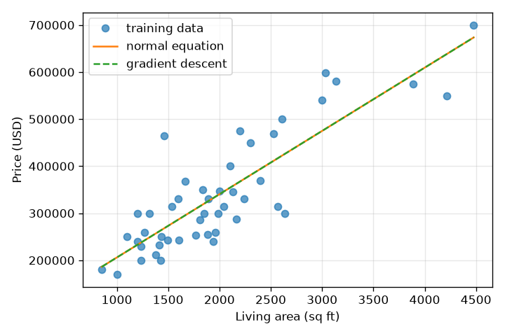
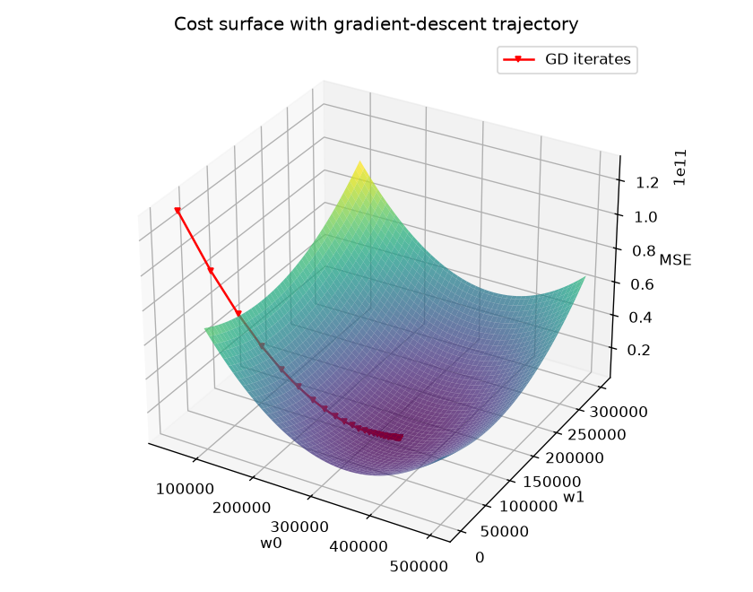
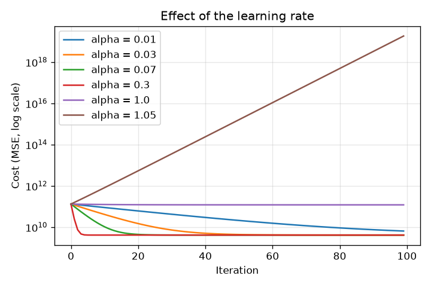

# Linear regression: gradient descent vs. the normal equation

**Task.** Predict house price from living area (47 houses, Portland OR — the
classic CS229 dataset) two ways: the closed-form normal equation, and batch
gradient descent on a standardised feature. Report the learned weights and
the predicted price of a 1,650 sq ft house from each.

**Result (as submitted).**

| | Normal equation | Gradient descent |
|---|---|---|
| Price of 1,650 sq ft | **$293,237.22** | **$293,237.14** |
| w0 | 71,270.49 | 340,412.56 |
| w1 | 134.53 | 106,907.52 |

The weights look wildly different because they live on different scales — the
normal equation was fit on raw square feet, gradient descent on the
standardised feature `(x − μ)/σ` — but both describe the same line, which is
why the predictions agree to the cent.

## Method

**Model.** `ŷ = w0 + w1·x`, written as `ŷ = Xw` with `X = [1, x]`.

**Normal equation.** `w = (XᵀX)⁻¹Xᵀy`. One linear solve, no iteration, no
need to scale the feature.

**Gradient descent.** Loss `J(w) = (1/m)‖y − Xw‖²`. Differentiating the
quadratic form gives `∇J = −(2/m)Xᵀ(y − Xw)`, and the update is
`w ← w − α∇J`. Run for 100 iterations at α = 0.07; cost drops from 1.3×10¹¹
to 4.1×10⁹ and is flat well before iteration 100.

**Why standardise first.** Living area is in the thousands, the bias is 1; on
the raw scale the cost surface is an extremely elongated bowl and gradient
descent zig-zags. Standardising makes it round. The same μ and σ from training
are applied to the 1,650 sq ft query before predicting.

## Beyond the brief

**Learning-rate sensitivity.** Rerunning the loop across α shows the three
regimes: too small (0.01) is still converging at iteration 100; 0.07–0.3
converge cleanly; at α = 1.0 the iterates oscillate at constant cost; at 1.05
they diverge. For a standardised single feature the stability limit is α < 1,
which is exactly where this flips.

## Files

| File | |
|---|---|
| `gradient3student_neq.m`, `gradient3student_GD.m` | Submitted Octave scripts |
| `ex3x.txt`, `ex3y.txt` | Data: living area & bedrooms; price |
| `linear_regression.py` | Python port; reproduces the table above and all figures |

## A reproducibility gotcha

Octave's `std()` divides by *n − 1*; NumPy's `np.std()` divides by *n* unless
you pass `ddof=1`. Using the wrong one changes the standardised-scale `w1` in
the third significant figure (106,907 vs 105,764) — the prediction barely
moves, but the submitted table doesn't reproduce until you match the convention.
