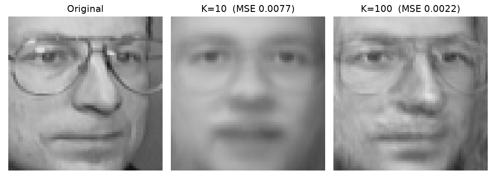
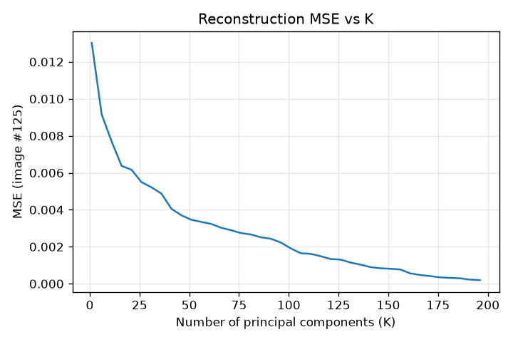

# PCA face-image compression

**Task.** Fit PCA on the Olivetti faces dataset (400 grayscale images, 64×64
pixels, 40 people), reconstruct each face from its top-K principal components,
and report the reconstruction error for image #125 at K=10 and K=100.

**Result.**

| K | Reconstruction MSE (image #125, pixels in [0, 1]) | Coefficients stored per image |
|---|---|---|
| 10 | 0.007717 | 10 (vs. 4,096 pixels — ~410:1) |
| 100 | 0.002167 | 100 (~41:1) |

## Method

1. Flatten each image to a 4,096-vector; stack into `X` (400 × 4,096).
2. Centre: subtract the mean face `x̄ = mean(X, axis=0)`. PCA finds the
   directions of maximum variance *around the mean*, so this step is required.
3. PCA via the SVD of the centred matrix, `X_c = UΣVᵀ`. The right-singular
   vectors `V` are the eigenvectors of the covariance matrix `X_cᵀX_c / (n−1)`,
   and `σ²/(n−1)` are its eigenvalues — but the SVD never forms the 4,096×4,096
   covariance matrix, which is both cheaper and better conditioned.
4. Project: `Z = X_c V_k` gives each face's coordinates in the K-dimensional
   subspace spanned by the top-K "eigenfaces".
5. **Reconstruct (the assignment's blank):** `X̂ = Z V_kᵀ + x̄`. The `+ x̄` is
   the step that's easy to forget — `PCA.inverse_transform` undoes the
   projection but not the centring, and without it the reconstructions are
   not recognisable as faces.
6. Error: per-pixel MSE between the original and reconstructed image.

## Beyond the brief

Sweeping K from 1 to 200 shows the diminishing returns: error falls steeply
over the first ~20–30 components, then flattens. Most of the variance in a face
lives in a small number of leading directions.

## Notes

- `svd_solver="full"` is set explicitly. scikit-learn's default picks a
  randomised solver for this matrix shape, which makes the K=100 error vary in
  the third significant figure between runs.
- The instructor's Octave track uses the original 112×92 AT&T images;
  scikit-learn's `fetch_olivetti_faces()` returns a 64×64 downsampled version
  of the same 400 images, so pixel counts differ between the two tracks.
